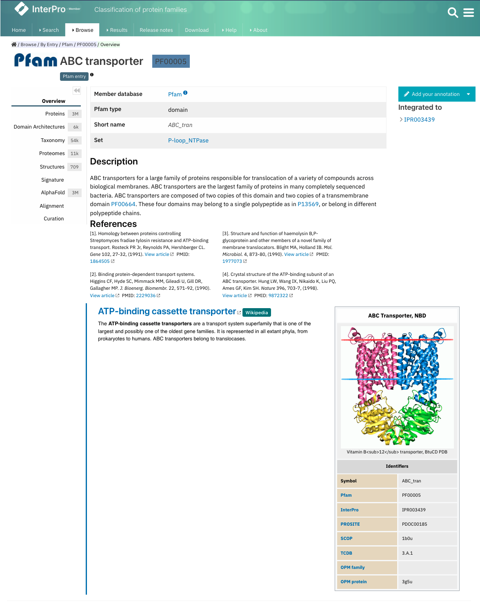

.. _wikipedia:

****************************
Pfam Annotation in Wikipedia
****************************

Pfam encourages the annotation of Pfam entries via Wikipedia. Below the traditional description of the Pfam entry, you may find the text from a Wikipedia article that we feel provides a good description of the Pfam entry.

Wikipedia content in the website
=====================================

When we build a new Pfam family, we try to find a Wikipedia article that describes the family and provides what we feel to be a valuable annotation for it.

Where a Wikipedia article has been assigned to a family, the **Overview** tab of the Pfam family page will show the first paragraph of the article together with the image and main table on it, below the traditional Pfam annotation created by curators. Click on the title of the Wikipedia article for the full article to open in a new tab.

    The **Overview** tab of the Pfam family page shows the associated Wikipedia article if available.

Contributing annotations
========================

One of the advantages of using Wikipedia to provide our annotations is that any user can now contribute to that annotation text. In many cases, families that do not yet have a Wikipedia article can be assigned an article that already exists. In some cases, however, no suitable article exists, and in that case we would encourage you to consider adding one to Wikipedia yourself.

You can now contribute to the improvement of Pfam annotations in several ways. Besides giving feedbact directly to the curators to improve the traditional description, you can improve existing Wikipedia articles linked to Pfam families. In addition, if you come across a family that does not yet have a Wikipedia article assigned to it, we would really like to add one. If you know of an article that would provide a useful description of a family, please let us know via our annotation submission form (click the **Add your annotation** button on the family page) or by email through our `helpdesk <https://www.ebi.ac.uk/about/contact/support/interpro>`_.

Editing Wikipedia articles
==========================

Before you edit for the first time
----------------------------------

Wikipedia is a free, online encyclopedia. Although anyone can edit or contribute to an article, Wikipedia has some strong editing guidelines and policies, which promote the Wikipedia standard of style and etiquette. Your edits and contributions are more likely to be accepted (and remain) if they are in accordance with this policy.

You should take a few minutes to view the following pages:

    * `Five pillars <http://en.wikipedia.org/wiki/Wikipedia:Five_pillars>`_
    * `Policies and guidelines <http://en.wikipedia.org/wiki/Help:Contents/Policies_and_guidelines>`_
    * `Wikipedia help contents <http://en.wikipedia.org/wiki/Help:Contents>`_
    * `Wikipedia Tips <http://en.wikipedia.org/wiki/Wikipedia:Tips>`_
    * `Editing help <http://en.wikipedia.org/wiki/Help:Contents/Editing_Wikipedia>`_

How your contribution will be recorded
--------------------------------------

Anyone can edit a Wikipedia entry. You can do this either as a new user or you can register with Wikipedia and log on. When you click on the "Edit Wikipedia article" button, your browser will direct you to the edit page for this entry in Wikipedia. If you are a registered user and currently logged in, your changes will be recorded under your Wikipedia user name. However, if you are not a registered user or are not logged on, your changes will be logged under your computer's IP address. This has two main implications. Firstly, as a registered Wikipedia user your edits are more likely seen as valuable contribution (although all edits are open to community scrutiny regardless). Secondly, if you edit under an IP address you may be sharing this IP address with other users. If your IP address has previously been blocked (due to being flagged as a source of 'vandalism') your edits will also be blocked. You can find more information on this and creating a `user account <http://en.wikipedia.org/wiki/Wikipedia:Why_create_an_account>`_ at Wikipedia.

If you have problems editing a particular page, contact us at interhelp@ebi.ac.uk and we will try to help.

Does Pfam agree with the content of the Wikipedia entry?
--------------------------------------------------------

Pfam has chosen to link families to Wikipedia articles. In some case we have created or edited these articles but in many other cases we have not made any direct contribution to the content of the article. The Wikipedia community does monitor edits to try to ensure that (a) the quality of article annotation increases, and (b) vandalism is very quickly dealt with. However, we would like to emphasise that Pfam does not curate the Wikipedia entries and we cannot guarantee the accuracy of the information on the Wikipedia page.

Contact us
----------

If you have problems editing or experience problems with these pages please contact us at interhelp@ebi.ac.uk
